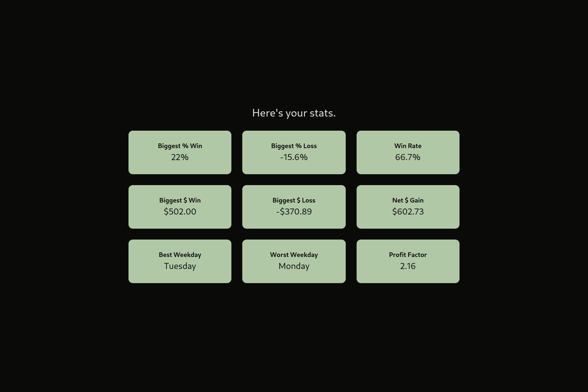

# TradingVisu
A trading performance calculator for TradeZero

 

## Statistics Displayed
The app provides users with the following statistics based on their trading data:
- Biggest Percent Win%
- Biggest Percent Loss%
- Win Rate
- Biggest Dollar Win
- Biggest Dollar Loss
- Net Dollar Gain
- Best Weekday
- Worst Weekday
- Profit Factor

<!-- - **CSV Data Upload**: Users can upload their trading data in CSV format. -->
<!-- - **Data Processing**: The app uses the Pandas library to process the uploaded data. -->
<!-- - **Dynamic HTML Generation**: Displays HTML output that includes statistics such as Win Rate and Net Gain -->

## Installation

To set up the Trading Visualizer web app, follow these steps:

1. **Clone the repository**:
```bash
git clone https://github.com/Lomzem/TradingVisu.git
cd TradingVisu
```

2. **Create a virtual environment** (optional):
```bash
python -m venv venv
source venv/bin/activate
```

3. **Install required packages**:
```bash
pip install -r requirements.txt
```

4. **Run the development server**:
```bash
python manage.py runserver
```

## Usage
1. **Access the app**: Open your web browser and navigate to `http://127.0.0.1:8000/`
2. **Upload CSV File**: Click on the **upload** button on the page and select your CSV file containing trading data.
3. **View Statistics**: The page will change into a dashboard displays statistics based on your trading data.

## Obtaining a CSV file

### TradeZero
1. In your TradeZero portal, click **Account Overview**.
2. Click the **Trades** tab under **My Account - Daily Info**.
3. Choose your desired date range.
4. Click on the **Excel Icon** to export your trading data as a CSV file.

### Other Sources
While this app is designed primarily for handling CSV exports from the web portal for TradeZero, it is possible to use other sources for trading data if the CSV has the appropriate columns.

To help get you started, you can download an example CSV file [here](https://github.com/Lomzem/TradingVisu/example.csv)

In general, the CSV files must have these columns:
- `T/D`: The date of the transaction.
- `Side`: One of four options: `B`, `S`, `SS`, or `BC` for Buy, Sell, Short Sell, and Buy Cover respectively.
- `Symbol`: The stock ticker of the transaction.
- `Qty`: The number of shares in the transaction.
- `Price`: The stock price of the transaction.
- `Exec Time`: The time of the transaction.


## Technologies Used
- **Django**: Backend framework for building the web application.
- **Pandas**: Library for data manipulation and analysis.
- **Tailwind CSS**: CSS Framework for styling the frontend


<!-- # Run the App -->
<!-- This app uses Django -->
